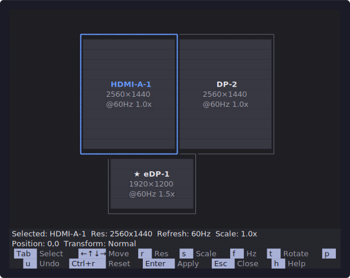
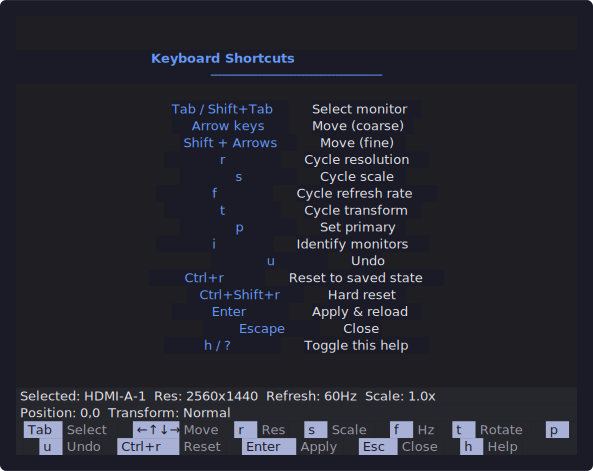
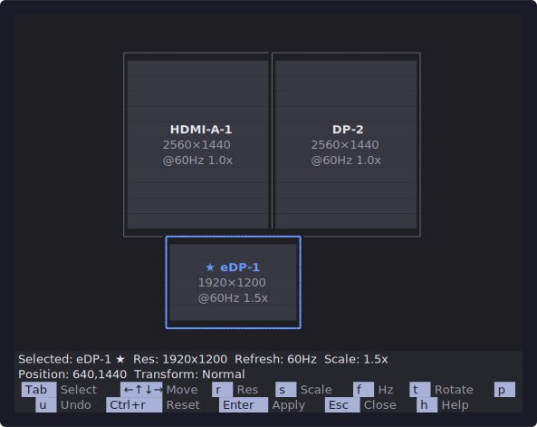
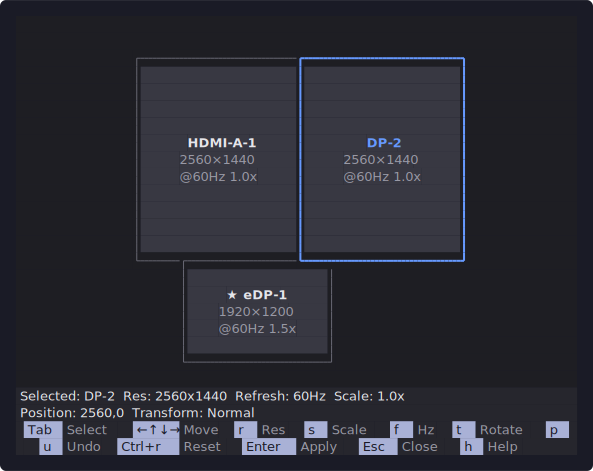

<p align="center">
  
</p>

<h1 align="center">Omarchy Monitor Arrange</h1>

<p align="center">
  <strong>A keyboard-first visual monitor arrangement tool for <a href="https://omarchy.com">Omarchy</a></strong><br>
  Drag, snap, and configure multi-monitor layouts — right from your terminal.
</p>

<p align="center">
  
  
  
  
</p>

---

## Screenshots

<table>
  <tr>
    <td align="center"><strong>Main View</strong></td>
    <td align="center"><strong>Help Overlay</strong></td>
  </tr>
  <tr>
    <td></td>
    <td></td>
  </tr>
  <tr>
    <td align="center"><strong>Monitor Selected (eDP-1)</strong></td>
    <td align="center"><strong>Monitor Selected (DP-2)</strong></td>
  </tr>
  <tr>
    <td></td>
    <td></td>
  </tr>
</table>

## Features

- **Visual 2D canvas** — see your monitors as proportional rectangles in the terminal
- **Keyboard-first** — navigate, move, resize, and configure without touching a mouse
- **Smart snapping** — monitors snap to edges and align automatically
- **Live config** — writes directly to `~/.config/hypr/monitors.conf` and reloads Hyprland
- **Undo support** — made a mistake? press `u` to revert
- **Monitor identify** — flash monitor names on physical displays

## Requirements

- [Hyprland](https://hyprland.org) (running — uses `hyprctl`)
- Python 3.11+

## Quick Start

### Install

```bash
git clone https://github.com/omarchy/omarchy-monitor-arrange.git
cd omarchy-monitor-arrange
./install.sh
```

Then launch with:

```bash
omarchy-monitor-arrange
```

Or press **Super + Alt + M** (keybinding added automatically).

### Uninstall

```bash
./install.sh --uninstall
```

### Development

Run directly from the source tree:

```bash
python3 -m pip install -r requirements.txt
PYTHONPATH=src python3 -m omarchy_monitor_arrange
```

## Keyboard Controls

| Key | Action |
|:---|:---|
| <kbd>Tab</kbd> / <kbd>Shift+Tab</kbd> | Select next / previous monitor |
| <kbd>Arrow keys</kbd> | Move selected monitor (coarse) |
| <kbd>Shift</kbd> + <kbd>Arrows</kbd> | Move selected monitor (fine, 1 px) |
| <kbd>r</kbd> | Cycle resolution |
| <kbd>s</kbd> | Cycle scale (1 &rarr; 1.25 &rarr; 1.5 &rarr; 1.75 &rarr; 2 &rarr; 3) |
| <kbd>f</kbd> | Cycle refresh rate |
| <kbd>t</kbd> | Cycle transform (Normal &rarr; 90&deg; &rarr; 180&deg; &rarr; 270&deg;) |
| <kbd>p</kbd> | Set selected as primary |
| <kbd>i</kbd> | Identify &mdash; flash name on each physical display |
| <kbd>u</kbd> | Undo last move |
| <kbd>Enter</kbd> | Apply &mdash; write config and reload Hyprland |
| <kbd>Escape</kbd> | Close without saving |
| <kbd>h</kbd> / <kbd>?</kbd> | Toggle help overlay |

## Architecture

```
src/omarchy_monitor_arrange/
├── core/             # Pure logic — models, layout engine, config writer, manager
│   ├── models.py     # Monitor dataclass, snap/overlap types
│   ├── layout.py     # Snap-to-edge, overlap detection, gap closing
│   ├── config.py     # Read/write monitors.conf
│   └── manager.py    # Orchestrates core operations, undo stack
├── backends/         # Compositor abstraction (Hyprland today, others later)
│   ├── base.py       # MonitorBackend protocol
│   └── hyprland.py   # hyprctl integration
├── ui/               # Presentation layer
│   ├── base.py       # MonitorArrangeUI protocol
│   └── textual/      # Textual TUI implementation
│       ├── app.py    # Main application
│       ├── canvas.py # 2D monitor canvas widget
│       ├── statusbar.py
│       ├── shortcuts.py
│       └── geometry.py
└── theme.py          # Omarchy theme color loading
```

The architecture is **interface-driven**: core knows nothing about UI, UI knows nothing about Hyprland. All layer boundaries use [Python Protocols](https://peps.python.org/pep-0544/) for clean separation of concerns.

## Running Tests

```bash
PYTHONPATH=src python3 -m pytest tests/ -v
```

## Omarchy Menu Integration

To add a **Monitors** entry to the Omarchy setup menu, create or edit `~/.config/omarchy/extensions/menu.sh` and override `show_setup_menu()` so the Monitors case launches `omarchy-monitor-arrange`. See `PLAN.md` for the full menu override snippet.
